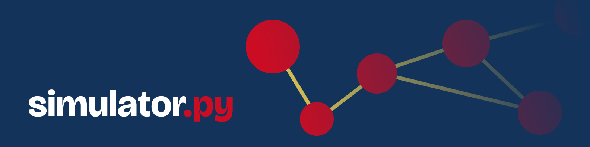

<h1 align='center'>
    Simulator: Simulate your problems and find the best solutions
</h1>

    Contrubitors:
  <a href="https://github.com/GuilhermeCosta-Ferreira">Guilherme Costa Ferreira</a>

    
    
    
    
    
    <!-- coverage-badge:start -->
    
    <!-- coverage-badge:end -->

---

## Overview
The Simulator is a tool to help tackle complex systems problems. With the easy of costumization this tool allows to simulate intricate societal contexts, organization hierarchical botlenecks and other sort of network problems.
