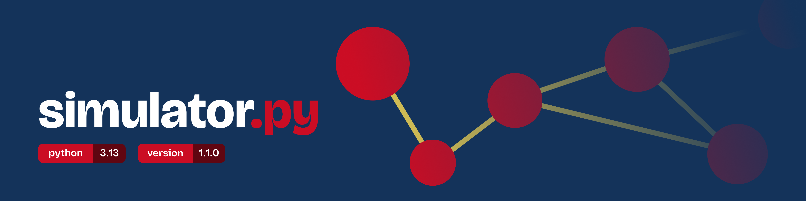

<h1 align='center'>
    Simulator: Simulate your problems and find the best solutions
</h1>

    Contrubitors:
  <a href="https://github.com/GuilhermeCosta-Ferreira">Guilherme Costa Ferreira</a>

    
    
    
    
    
    <!-- coverage-badge:start -->
    
    <!-- coverage-badge:end -->
    

---

## Overview
The Simulator is a tool to help tackle complex systems problems. With the easy of costumization this tool allows to simulate intricate societal contexts, organization hierarchical botlenecks and other sort of network problems.

## License
Licensed under the [GNU Affero General Public License v3.0 or later](LICENSE) (AGPL-3.0-or-later). Copyright (C) 2026 GuilhermeCF.

If you run a modified version of this software as a network service, the AGPL requires you to make the corresponding source available to users of that service: see [LICENSE](LICENSE) §13 for the exact terms.
